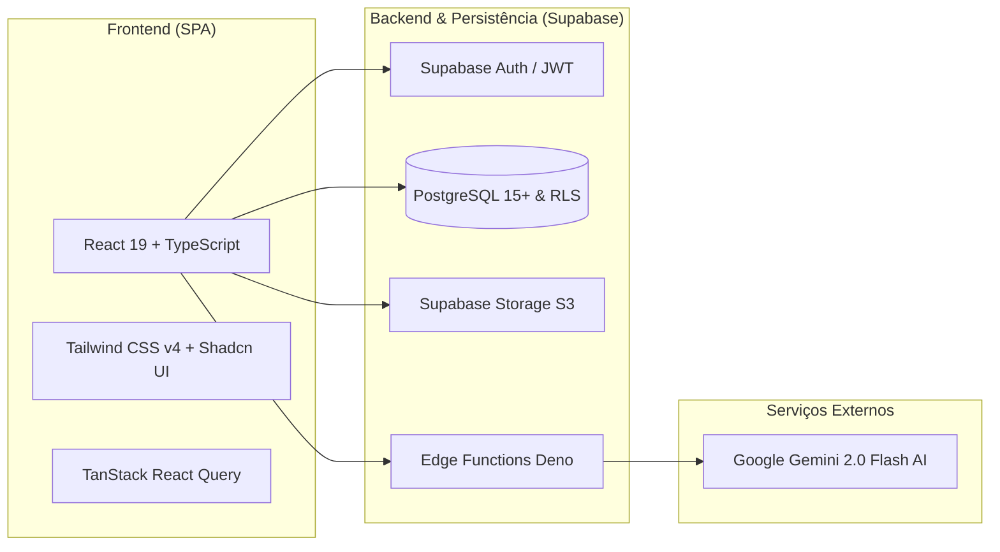

<div align="center">

# 🏛️ NEXUS ERP — Gestão Inteligente de Vendas Públicas & Logística

**Plataforma corporativa de alto desempenho para gestão de Empenhos Públicos, Atas de Registro de Preços (ARP), Baixa Inteligente de Mercadorias via IA e Cadeia de Suprimentos.**

[](https://react.dev/)
[](https://www.typescriptlang.org/)
[](https://vitejs.dev/)
[](https://tailwindcss.com/)
[](https://supabase.com/)
[](https://aistudio.google.com/)
[](LICENSE)

[Visão Geral](#-visão-geral) •
[Destaques de Engenharia](#-destaques-de-engenharia) •
[Módulos do Sistema](#-módulos-do-sistema) •
[Arquitetura](#-arquitetura) •
[Como Executar](#-como-executar-localmente) •
[Segurança & RLS](#-segurança-e-rbac)

---

</div>

## 🌟 Visão Geral

O **Nexus ERP** foi projetado para resolver a complexidade operacional enfrentada por distribuidores e fornecedores que atendem o setor público brasileiro (Prefeituras, Hospitais, Fundos Municipais e Secretarias de Saúde). 

A plataforma automatiza todo o fluxo — desde a **ingestão e leitura por IA de Notas de Empenho (PDF)** até o **controle de entregas fracionadas**, **abatimento de saldo em Atas**, **compras sob demanda (SLA)** e **auditoria de ponta a ponta**.

```
[ PDF Empenho / Ata ] ──> [ IA Gemini OCR & Parser ] ──> [ Cadastro Estruturado ]
                                                                   │
                                ┌──────────────────────────────────┴──────────────────────────────────┐
                                ▼                                                                     ▼
                   [ Módulo de Logística / Baixa ]                                       [ Módulo de Compras & Cotações ]
                    ├─ Baixa por XML (NF-e)                                               ├─ Solicitação Automática de Reposição
                    ├─ Baixa por Pedido (DAV com Mapeamento Multi-Vínculo)                 ├─ Agrupamento por Fornecedor / Fabricante
                    └─ Abatimento de Saldo em Ata (RPC)                                  └─ Cotações Privadas & Histórico de Preços
```

---

## 🚀 Destaques de Engenharia de Software

- **Extração Inteligente com Google Gemini 2.0 Flash**: Parsing semântico de PDFs não estruturados de empenhos de diferentes órgãos públicos, extraindo dados cadastrais, itens, valores unitários, quantidades e prazos de entrega em segundos.
- **Mapeamento Flexível de Baixas (Multi-Vínculo & Conversão)**: Permite associar itens de um Pedido/XML a múltiplos itens de empenhos distintos, com suporte a conversão de unidades (multiplicação, divisão e regras de arredondamento matemático).
- **Abatimento Transacional de Saldo em Atas (ARP)**: Funções em banco de dados (`Stored Procedures / RPC`) que garantem atomicidade e consistência no consumo de saldos compartilhados.
- **Row-Level Security (RLS) & RBAC Multinível**: Isolamento estrito de visibilidade entre Direção, Gestores, Operadores e Vendedores a nível de banco de dados (PostgreSQL).
- **Interface Moderna & Acessível**: Construída com **React 19**, **Tailwind CSS v4** e primitivos acessíveis do **Radix UI / Shadcn UI**, oferecendo suporte total a Dark/Light mode e micro-interações fluidas.

---

## 📦 Módulos do Sistema

### 1. 📄 Gestão de Empenhos & Atas de Registro de Preços
- Cadastro unificado inteligente com leitura automática via IA.
- Controle de status em tempo real (`Pendente`, `Parcial`, `Entregue`, `Notificado`, `Cancelado`).
- Monitoramento de SLAs de entrega com contagem regressiva e alertas de urgência / demandas judiciais.

### 2. 🚚 Baixas Inteligentes de Mercadorias
- **Baixa por NF-e (XML)**: Leitura de XML de Nota Fiscal com pareamento inteligente de itens, validação de preços unitários e justificativas obrigatórias de divergência.
- **Baixa por Pedido (DAV / Provisória)**: Suporte a distribuição de um item de pedido entre diferentes linhas de empenho e reversão granular de lançamentos com proteção de SLA.

### 3. 🛒 Módulo de Compras & Suprimentos
- Disparo automático de pedidos de compra a partir de saldos pendentes de empenho.
- Gestão de prazos de compras independentes do prazo contratual do cliente.
- Agrupamento de demandas por fabricante, cotação com distribuidores e acompanhamento de status (`Solicitado`, `Cotando`, `Comprado`, `Atendido`).

### 4. 💼 Cotações Privadas & Marketplace
- Gestão de solicitações de cotação para o setor privado ou demandas especiais de clientes públicos.
- Envio direto de cotações a partir de itens de empenho existentes.

### 5. 🛡️ Painel Administrativo, Auditoria & Segurança
- Histórico imutável de logs de auditoria para ações críticas (exclusões de documentos com confirmação de senha de administrador).
- Gestão granular de permissões de usuários por setor e território.

---

## 🏛️ Arquitetura



---

## 🛠️ Como Executar Localmente

### Pré-requisitos
- **Node.js**: v18.0.0 ou superior
- **npm** ou **pnpm**
- Conta gratuita no [Supabase](https://supabase.com) e no [Google AI Studio](https://aistudio.google.com)

### 1. Clonar o repositório
```bash
git clone https://github.com/seu-usuario/nexus-erp.git
cd nexus-erp
```

### 2. Instalar dependências
```bash
npm install
```

### 3. Configurar variáveis de ambiente
Copie o arquivo `.env.example` para `.env.local`:
```bash
cp .env.example .env.local
```
Preencha as variáveis com as chaves do seu projeto Supabase e Gemini:
```env
VITE_SUPABASE_URL=https://seu-projeto.supabase.co
VITE_SUPABASE_ANON_KEY=sua-chave-anonima-do-supabase
VITE_GOOGLE_API_KEY=sua-chave-api-gemini
```

### 4. Popular o Banco com Dados Fictícios de Demonstração
Execute o script de dados fictícios presente em [`supabase/seed.sql`](supabase/seed.sql) diretamente no **SQL Editor** do Supabase para ter prefeituras, empenhos, atas e cotações de teste prontas para uso.

### 5. Iniciar o servidor de desenvolvimento
```bash
npm run dev
```
Acesse a aplicação em `http://localhost:5173`.

---

## 🔒 Segurança e RBAC

O Nexus implementa controle de acesso rigoroso baseado em papéis (RBAC) suportado nativamente pelo **Row-Level Security (RLS)** do PostgreSQL:

| Papel | Escopo de Visualização | Acesso Administrativo |
| :--- | :--- | :--- |
| **DIREÇÃO** | Todas as entidades, documentos e histórico global | Sim (Auditoria, exclusões com senha, configurações) |
| **GESTÃO** | Todos os empenhos, atas e fluxo de compras | Parcial (Relatórios e compras) |
| **OPERACIONAL** | Documentos e entregas do seu setor | Não |
| **VENDEDOR** | Apenas empenhos e cotações sob sua titularidade | Não |

---

## 📄 Licença

Este projeto está sob a licença [MIT](LICENSE).

---

<div align="center">
Desenvolvido com foco em excelência técnica e usabilidade corporativa.
</div>
