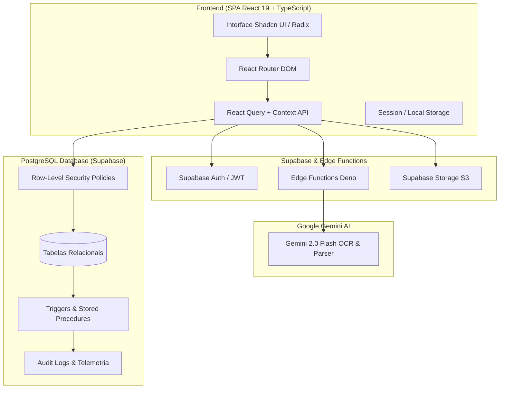
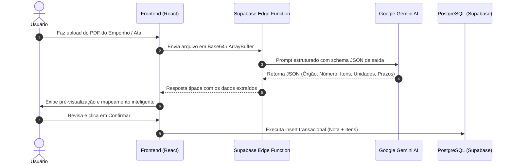

# Arquitetura e Engenharia de Software - Nexus ERP

O **Nexus ERP** é uma plataforma corporativa em nuvem desenvolvida para simplificar e automatizar o ciclo completo de gestão de vendas públicas (licitações, atas de registro de preços e notas de empenho), faturamento, baixas parciais de mercadorias e planejamento de compras com inteligência artificial.

---

## 🏛️ Visão Geral da Arquitetura

O sistema adota uma arquitetura moderna orientada a componentes no frontend com backend desacoplado em modelo **Backend-as-a-Service (BaaS)** e **Edge Computing**.

---

## 💻 Tecnologias e Bibliotecas

| Camada | Tecnologia | Função Principal |
| :--- | :--- | :--- |
| **Framework Web** | React 19 + TypeScript | SPA de alta performance com tipagem estática rigorosa. |
| **Bundler & Build** | Vite 8 + Rolldown | HMR ultrarrápido e otimização avançada de chunks. |
| **Estilização** | Tailwind CSS v4 + Shadcn UI | Design System moderno, responsivo e com suporte a Dark Mode. |
| **Banco & Backend** | Supabase (PostgreSQL 15+) | Persistência relacional, autenticação JWT, Storage e RLS. |
| **Motor de IA** | Google Gemini 2.0 Flash | Extração estruturada de PDFs de empenhos, atas e notas fiscais. |
| **Visualização** | Recharts + Lucide Icons | Dashboards analíticos em tempo real e iconografia semântica. |
| **Relatórios / PDF** | jsPDF + pdf-lib + pdfjs-dist | Geração e manipulação de documentos PDF no lado cliente. |

---

## 🛡️ Camada de Segurança e RLS (Row-Level Security)

A aplicação não depende exclusivamente de validações no frontend. Cada consulta e mutação de dados é validada a nível de banco de dados pelo PostgreSQL:

1. **Role-Based Access Control (RBAC)**:
   - **DIREÇÃO / ADMIN**: Acesso integral a todas as operações, logs de auditoria e exclusões com senha mestra.
   - **GESTÃO**: Acesso gerencial a empenhos, compras e cotações.
   - **OPERACIONAL**: Visualização e lançamento de baixas e notas do seu setor/território.
   - **VENDEDOR**: Isolamento estrito de dados (visualiza apenas os empenhos e cotações sob sua titularidade ou território).
2. **Políticas RLS Rigorosas**:
   - `notas_select_policy`, `itens_select_policy`, `pedidos_compra_policy`: Verificam `auth.uid()` e o cargo do perfil antes de retornar qualquer registro.

---

## ⚡ Fluxo de Ingestão de Documentos com Inteligência Artificial

