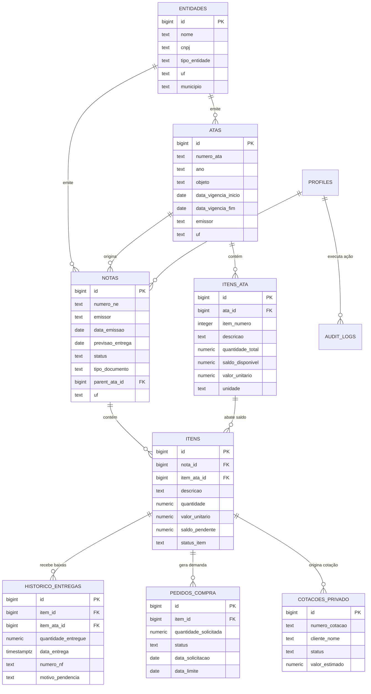

# Esquema de Banco de Dados e Entidades - Nexus ERP

O banco de dados do **Nexus ERP** é modelado no **PostgreSQL**, estruturado para suportar relacionamentos complexos entre Atas de Registro de Preços (ARP), Notas de Empenho (NE), Baixas Parciais/Totais, Solicitações de Compras e Cotações.

---

## 📊 Diagrama Entidade-Relacionamento (ERD)

---

## 🔑 Principais Tabelas e Regras de Negócio

### 1. `notas` (Notas de Empenho)
- Representa o documento formal de empenho emitido pela entidade pública.
- Possui status dinâmico (`PENDENTE`, `PARCIAL`, `ENTREGUE`, `CANCELADO`).
- Controla datas de recebimento, SLA de entrega e alertas de vencimento iminente.

### 2. `itens` (Itens do Empenho)
- Registra a especificação do produto, quantidade empenhada, valor unitário contratado e o `saldo_pendente`.
- Quando vinculado a uma Ata (`item_ata_id`), suas entregas abatem automaticamente o saldo global daquela ata via trigger / RPC.

### 3. `historico_entregas` (Baixas e Recebimentos)
- Armazena cada lançamento de entrega física ou faturamento por Nota Fiscal (NF-e) ou Pedido de Venda (DAV).
- Registra observações de divergência, justificativas de entrega parcial e comprovantes em anexo.

### 4. `pedidos_compra` (Compras & Abastecimento)
- Disparado automaticamente quando um item de empenho possui saldo a entregar que excede o estoque disponível.
- Permite aos compradores agrupar demandas por fornecedor, cotar preços e registrar confirmação de compra com data de entrega prevista pelo fabricante.
